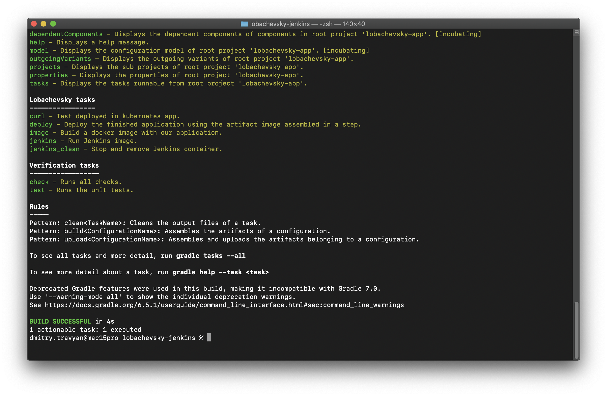
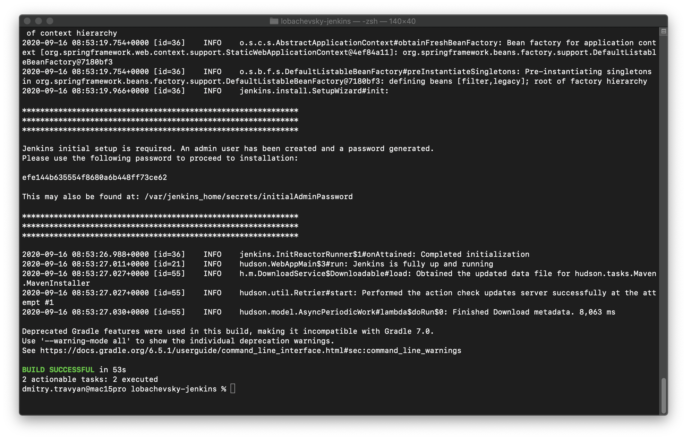
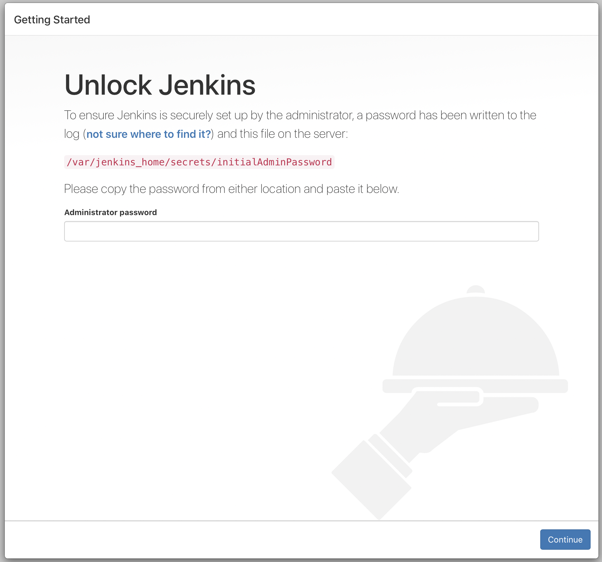
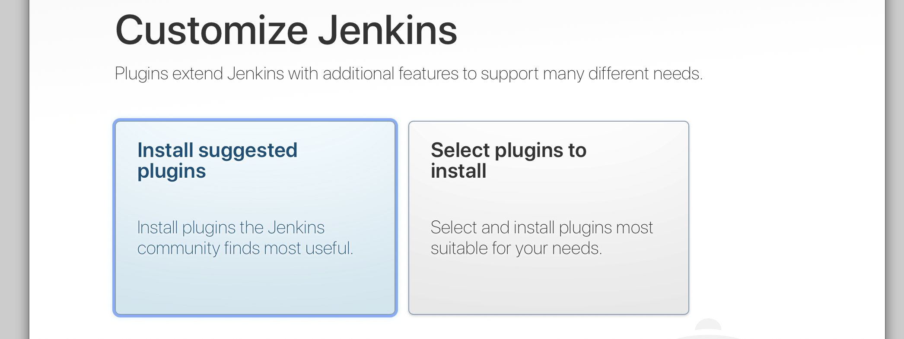
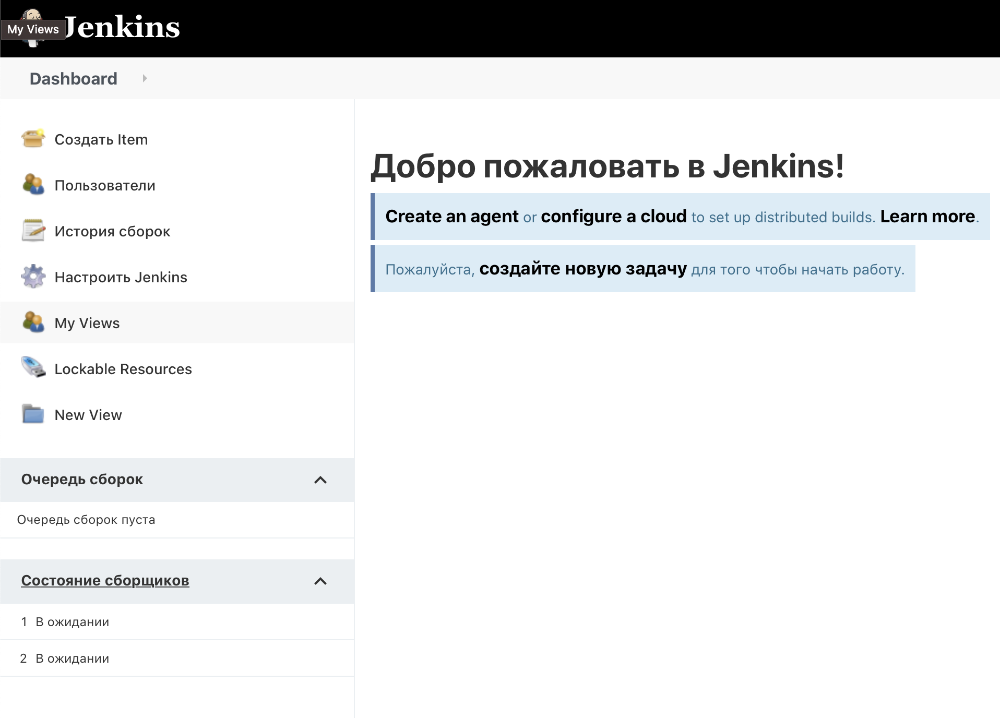
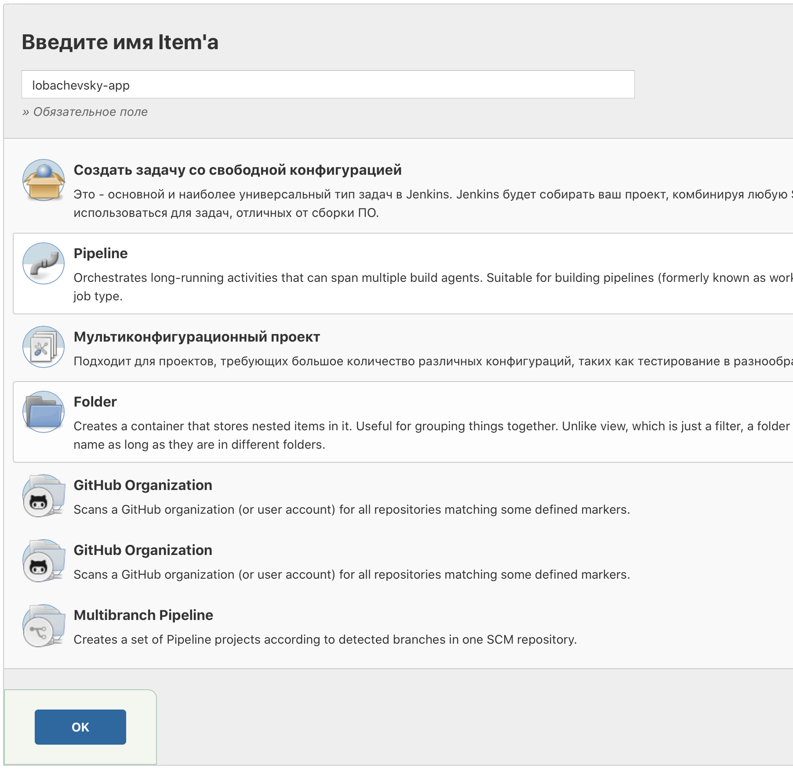
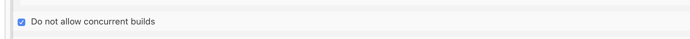
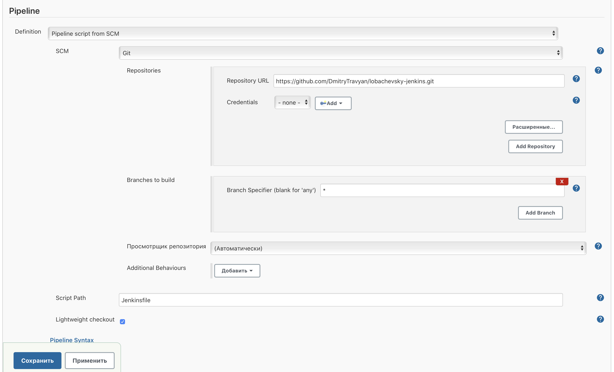
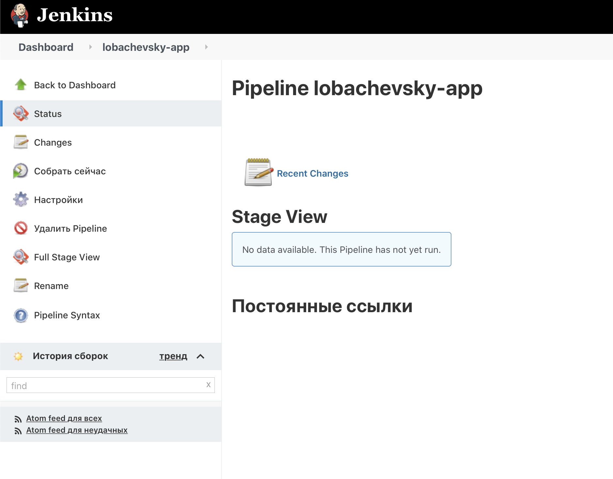
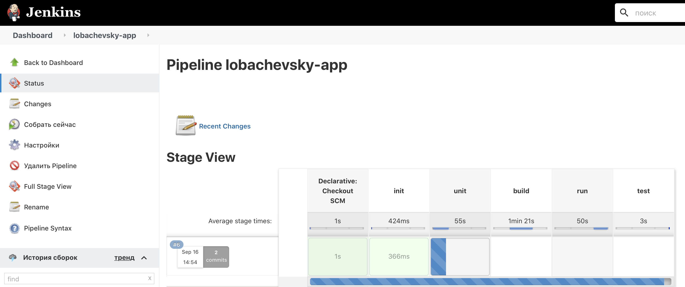

# lobachevsky-jenkins

## Содержание
- [Необходимые инструменты](#Heading)
- [Порядок работы](#Heading)
  * [Git clone](#sub-heading)
  * [Gradle](#sub-heading)
  * [Jenkins](#sub-heading)
  * [Pipeline](#sub-heading)
  * [Build and deploy](#sub-heading)
- [Контакты](#Heading)

---
<!-- toc -->
## Необходимые инструменты
[Устанавливаем Git в соответствии с гайдом](https://git-scm.com/book/ru/v2/Введение-Установка-Git)  
[Docker для Windows](https://docs.docker.com/docker-for-windows/install/)  
[Docker для Ubuntu](https://docs.docker.com/engine/install/ubuntu/)  
[Docker для Mac](https://docs.docker.com/docker-for-mac/install/)  
[Как установить Kubernetes в Docker](https://birthday.play-with-docker.com/kubernetes-docker-desktop/)  
[Gradle. Локальная установка (не обязательно)](https://gradle.org/install/)

---
## Порядок работы
#### Git clone
Клонируем себе репозиторий с помощью git.
```shell script
git clone https://github.com/DmitryTravyan/lobachevsky-jenkins.git
```

---
#### Gradle
Заходим в директорию склонированного нами репозитория, и проверяем что все работает. Здесь мы смотри какие tasks на доступны.
```shell script
# Если используем gradle wrapper
chmod +X ./gradlew
./gradlew tasks

# Если используем локальную инсталляцию Gradle
gradle tasks
```
Gradle должен вывести вот такой текст.


Где будет группа задач lobachevsky-tasks, с описанием что делает каждая из них.  

---
#### Jenkins
Теперь запускаем наш Jenkins.
```shell script
# Если используем gradle wrapper
./gradlew jenkins

# Если используем локальную инсталляцию Gradle
gradle jenkins
```

В STDOUT нашей консоли по окончании выполнения Gradle задачи, будет выведена команда docker logs.
Это логи запущенного в docker контейнера с Jenkins. Нам нужно скопировать оттуда токен.



Теперь переходим по адресу [http://localhost:8095](http://localhost:8095).
Это и есть только что запущенный нами Jenkins.  
Вставляем скопированный из логов токен в поле Administrator password.



Выбираем Install suggested plugins.



Как только установка звершится, нам нужно будет создать учетную запись администратора.


Страницу с именем хоста пропускаем.

---
#### Pipeline

Как только мы настроили Jenkins, нам надо создать pipeline.  
В меню слева выбираем Создать Item.



На следующей странице нам надо ввести имя Item-а и выбрать тип.  
Мы выбираем Pipeline и нажимаем OK.



Ставим галочку Do not allow concurrent builds.



На этой же странице, но уже в блоке Pipeline нам надо настроить SCM.
- Выбрать в меню Definition 'Pipeline script from SCM'
- Тим SCM выбрать 'Git'.
- Вставить в поле Repository url
```
https://github.com/DmitryTravyan/lobachevsky-jenkins.git
```
- Поле Branch Specifier разрешить билд всех веток (вставить *).
- Нажать кнопку сохранить.



Отлично! Теперь наша главная кнопка 'Собрать сейчас'.



---
#### Build and deploy

Как только будет нажата кнопка 'Собрать сейчас', Jenkins склонирует себе репозиторий, и запустит скрипт указанный в Jenkinsfile.
В котором есть только один stage, это init. В ходе этого стейджа Jenkins прочитает файл из директории src/main/groovy/ru/megafon/lobachevsky/jenkins/cicd.groovy
Уже в котором будут вызывать все остальные стадии сборки нашего приложения.



